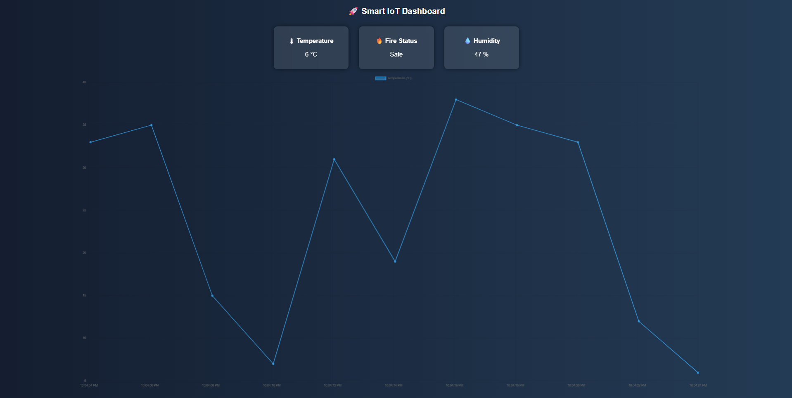

# 🚀 Smart IoT Dashboard

A modern IoT dashboard that simulates real-time sensor data with a clean UI and live graph visualization.

## 🔥 Features
- 🌡 Real-time Temperature Monitoring
- 🔥 Fire Risk Detection
- 💧 Humidity Tracking
- 📊 Live Updating Graph (Chart.js)
- 💎 Modern Glass UI Design

## 🛠 Tech Stack
- HTML
- CSS
- JavaScript
- Chart.js

## 📸 Preview

## 🚀 How to Run
1. Download or clone this repository
2. Open `index.html` in your browser
3. View live sensor simulation

## 📌 Project Goal
This project was built to demonstrate IoT data visualization and frontend development skills.

## 🔮 Future Improvements
- Connect real Arduino sensors
- Deploy online (Netlify / Vercel)
- Add alert notifications system

## 👨‍💻 Author
Shivam Vats